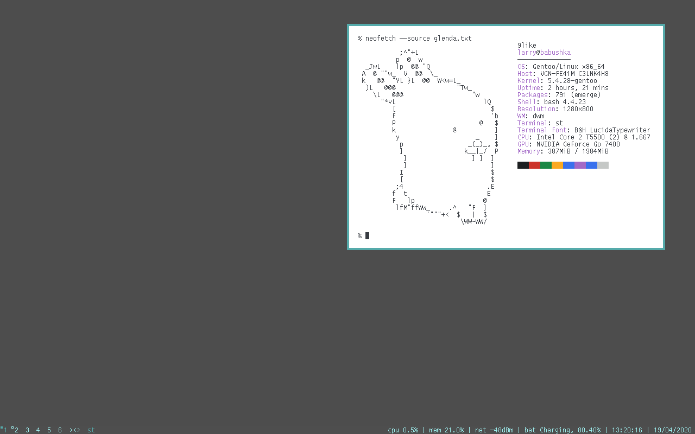
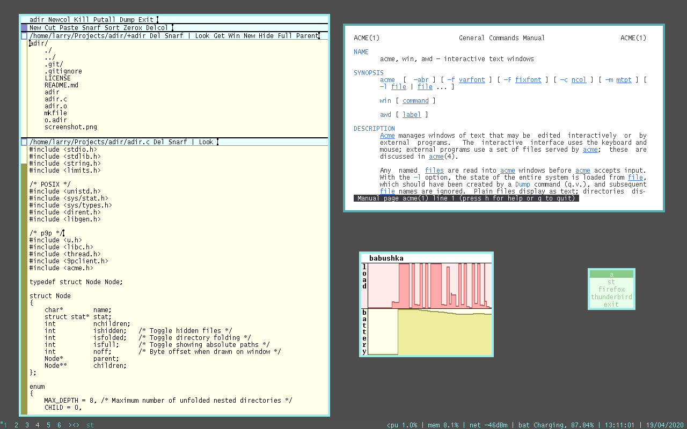

# 9like

> Configuration and scripts for a Plan 9 inspired dwm setup

## Configs

- dwm: [config.h](./dwm-config.h)
- st: [config.h](./st-config.h)
- status and background: [xsetroot](./autostart.sh)
- Acme: [plan9port (with some extra keybindings)](https://github.com/lewis-weinberger/plan9port) and [startup script](./a)
- 9menu: [9menu.sh](./9menu.sh)
- neofetch: [ascii art](./glenda.txt)

## Screenshots

